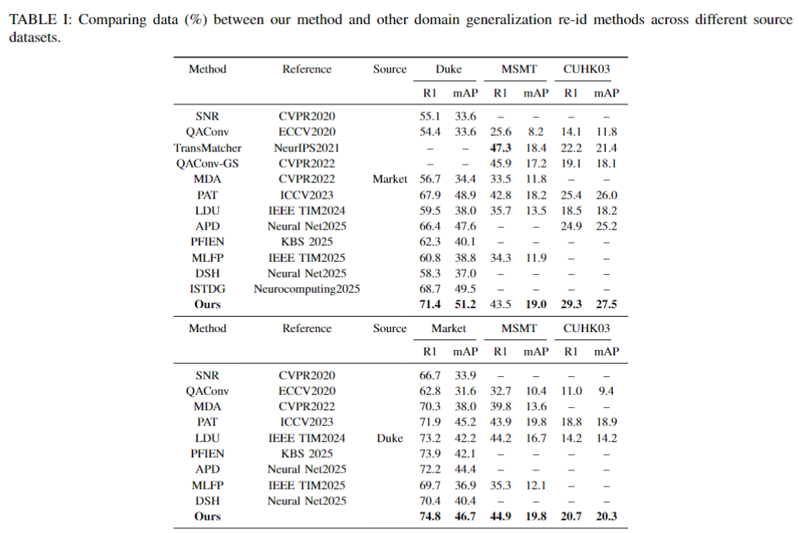

# ADSL

Here are some instructions to run our code.  
Our code is based on PAT, thanks for their excellent work.

---


## 1. Prepare your environment

```bash
conda create -n adsl python=3.10
conda activate adsl
pip install -r requirements.txt
```

---

## 2. Download the datasets

Duke and Market1501

---

## 3. Performance


